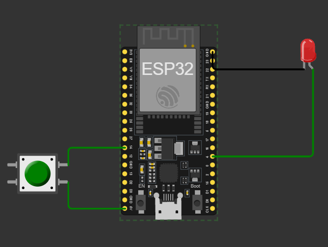

# Prender led con un botón en una ESP-32
Para está práctica se utilizó el microcontrolador ESP-32 a fin de prender y apagar un led al pulsar un boton.



## ¿Cómo funciona?
Una explicación rápida de como funciona. Definimos los pines a los que estará conectado el led y el boton. 
```c
int led=4;
int btn=14;
```
El botón al ser pulsado, entregará una entrada de energía, la cual está recibiendo  dado que su lado positivo se conecta a la fuente de $5V$.
Por otro lado, el led, necesitará recibir energía para prenderse, por ello, indicamos que su puerto será una salida, es decir que saldrá energía. Para cerrar el circuito se conecta a tierra del lado negativo.
```c
void setup() {
  Serial.begin(9600);
  pinMode(led, OUTPUT);
  pinMode(btn, INPUT);
}
```

Por último, para hacer que al pulsar el boton, reaccione el led. Estamos leyendo constantemente el estado del boton, en los casos cuando el botón se lea como que recibió energía, se entregará energía al led.
```c

void loop() {
  int edoBtn=digitalRead(btn);
  digitalWrite(led, edoBtn);
  delay(50);
}
```
> Nota. El delay se utiliza por que de lo contrario el simulador no puede ser ejecutado.

Puedes ver el circuito en: https://wokwi.com/projects/406841003433033729

## Licencia

Este proyecto se encuentra bajo la [licencia GNU General Public License](./license.md).

## Autoría

Este es un trabajo de Adrian (Adora) González [[@stariluz]](https://github.com/stariluz) para la materia de **Interacción Humano Computadora** de la *Facultad de Ingeniería de la Universidad Autónoma de Chihuahua*.

El catedrático y asesor de la materia es el mtro. Oscar Beltrán Gómez
[[@oscarbego]](https://github.com/oscarbego)
